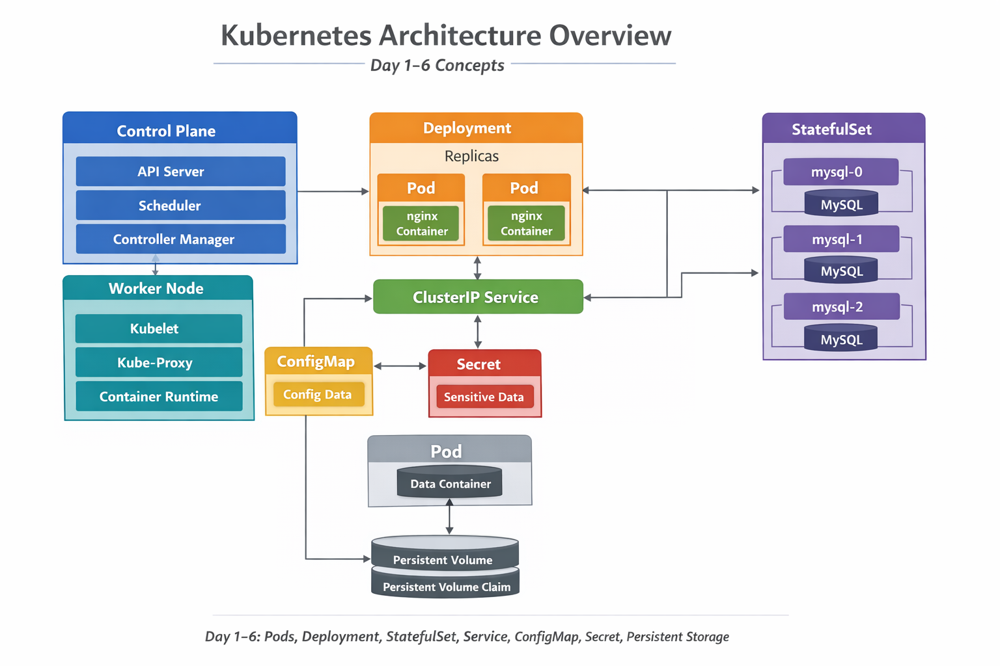

# Kubernetes Architecture – Day 1 to Day 6

This diagram summarizes the core components we’ve practiced so far:

- **Cluster & Nodes** → Control plane + worker nodes.
- **Pods** → Smallest deployable unit, containers inside.
- **Deployments** → Manage replicas of Pods, rolling updates.
- **Services** → Stable networking, load balancing across Pods.
- **ConfigMaps & Secrets** → Externalize configuration and sensitive data.
- **Persistent Volumes & Claims** → Provide durable storage for Pods.
- **StatefulSets & Headless Services** → Manage ordered, stable Pods for databases.

